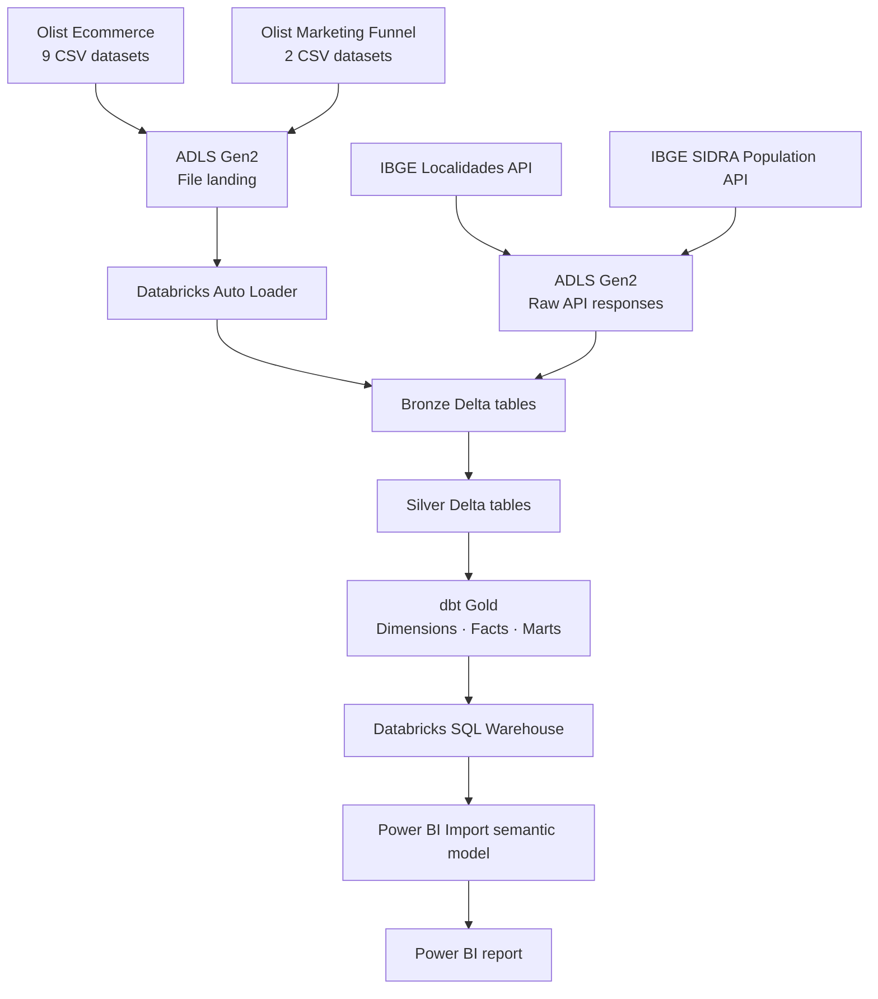

# Ecommerce Data Platform

This project integrates Olist ecommerce and marketing data with IBGE municipality and population data in an Azure Databricks lakehouse.

Batch files land in Azure Data Lake Storage Gen2 and are ingested incrementally with Databricks Auto Loader. PySpark handles Bronze and Silver processing, dbt builds the analytical Gold layer, and Databricks Jobs and Asset Bundles deploy the same workloads across dev, test, and prod. Power BI consumes selected Gold models through the Databricks SQL Warehouse.

**Technology:** Azure Databricks · Azure Data Lake Storage Gen2 · PySpark · Spark SQL · Delta Lake · Unity Catalog · Databricks Auto Loader · dbt Core · Databricks Jobs · Databricks Asset Bundles · GitHub Actions · Power BI

## Architecture



The Databricks data pipeline and the Power BI Import refresh run separately.

## Data Sources

| Source | Data |
|---|---|
| [Olist Brazilian E-Commerce](https://www.kaggle.com/datasets/olistbr/brazilian-ecommerce) | Customers, geolocation, orders, order items, payments, reviews, products, sellers, and product-category translations |
| [Olist Marketing Funnel](https://www.kaggle.com/datasets/olistbr/marketing-funnel-olist) | Marketing-qualified leads and closed deals |
| [IBGE Localidades API](https://servicodados.ibge.gov.br/api/docs/localidades) | Official municipality reference data |
| [IBGE SIDRA](https://servicodados.ibge.gov.br/api/docs/agregados?versao=3) | Municipality population estimates |

## Ingestion and Transformation

### Bronze and Silver

The 11 Olist ecommerce and marketing datasets use dataset-specific Auto Loader notebooks. Bronze retains source and ingestion metadata, `_rescued_data`, schema-tracking state, and checkpoint state for repeatable incremental ingestion.

Silver notebooks apply data types, standardization, deduplication where needed, and dataset-specific cleaning before the data is used by dbt.

IBGE Localidades and SIDRA responses are preserved before Bronze processing. Municipality population ingestion derives the required years from Silver orders and requests only years that have not already been loaded.

The repository keeps development notebooks separate from the parameterized operational notebooks used by Databricks Jobs.

### Gold with dbt

dbt builds normalization and intermediate models before the final dimensions, facts, marts, and quality model. Location models standardize Olist city/state values and map them to official IBGE municipalities.

| Layer | Models |
|---|---|
| Dimensions | `dim_customer`, `dim_date`, `dim_location`, `dim_municipality`, `dim_product`, `dim_seller` |
| Facts | `fact_orders`, `fact_order_items`, `fact_payments`, `fact_reviews`, `fact_mql`, `fact_closed_deals`, `fact_municipality_population` |
| Business marts | `mart_order_summary`, `mart_seller_acquisition` |
| Quality | `location_standardization_issues` |

### dbt Lineage


## Pipeline Orchestration

`ecommerce_platform` is the master Databricks Job. It runs `bronze_static`, `silver_static`, `ibge_enrichment`, and `gold` in sequence, while each child job remains independently runnable. Bronze contains 11 ingestion tasks, Silver contains 11 transformation tasks, IBGE enrichment contains four API tasks, and Gold runs `dbt build`.

### Master Pipeline

<p align="center">
  
</p>

### Bronze

<p align="center">
  
</p>

### Silver

<p align="center">
  
</p>

### IBGE Enrichment

<p align="center">
  
</p>

### Gold

<p align="center">
  
</p>

## Environments and CI/CD

The Databricks Asset Bundle source-controls the five Job resources and defines separate `dev`, `test`, and `prod` targets. The bundle target is passed into the operational jobs so catalogs, landing paths, and Auto Loader state remain environment-specific.

Pull requests run `dbt parse` and DEV bundle validation before merge.

| Target | Catalog | Deployment |
|---|---|---|
| DEV | `ecommerce_dev` | Pushes to `main` validate and deploy automatically |
| TEST | `ecommerce_test` | Manual promotion of an approved commit SHA; validates, deploys, and runs `ecommerce_platform` |
| PROD | `ecommerce_prod` | Manual promotion of an approved commit SHA; validates and deploys without automatically running the production pipeline |

The current platform release completed full runs in DEV and TEST, and the approved release was deployed to PROD.

## Data Quality

dbt tests cover uniqueness, required fields, relationships, accepted values, fact grain, join fanout, and selected business reconciliations. Location enrichment checks municipality mapping and protects against row multiplication.

The latest full dbt build passed in both DEV and TEST:

```text
PASS=168  WARN=0  ERROR=0  SKIP=0  NO-OP=0  TOTAL=168
```

## Power BI Report

Power BI imports selected Gold models through the Databricks SQL Warehouse.

### Executive Overview


### Orders & Delivery


### Product Performance


### Seller Acquisition


### Geography & Market Context


## Repository Structure

```text
.
├── .github/
│   └── workflows/
│       ├── ci.yml
│       ├── cd.yml
│       └── promote.yml
├── dbt/
│   ├── macros/
│   ├── models/
│   │   ├── sources/
│   │   ├── normalization/
│   │   ├── intermediate/
│   │   ├── marts/
│   │   │   ├── dimensions/
│   │   │   ├── facts/
│   │   │   └── business/
│   │   └── quality/
│   ├── tests/
│   └── dbt_project.yml
├── notebooks/
│   ├── development/
│   │   ├── bronze/
│   │   └── silver/
│   └── operational/
│       ├── bronze/
│       └── silver/
├── resources/
│   ├── bronze_static.job.yml
│   ├── silver_static.job.yml
│   ├── ibge_enrichment.job.yml
│   ├── gold.job.yml
│   └── ecommerce_platform.job.yml
├── screenshots/
├── databricks.yml
└── README.md
```

## Dataset

- [Olist Brazilian E-Commerce](https://www.kaggle.com/datasets/olistbr/brazilian-ecommerce)
- [Olist Marketing Funnel](https://www.kaggle.com/datasets/olistbr/marketing-funnel-olist)
- [IBGE Localidades API](https://servicodados.ibge.gov.br/api/docs/localidades)
- [IBGE SIDRA Population](https://servicodados.ibge.gov.br/api/docs/agregados?versao=3)
